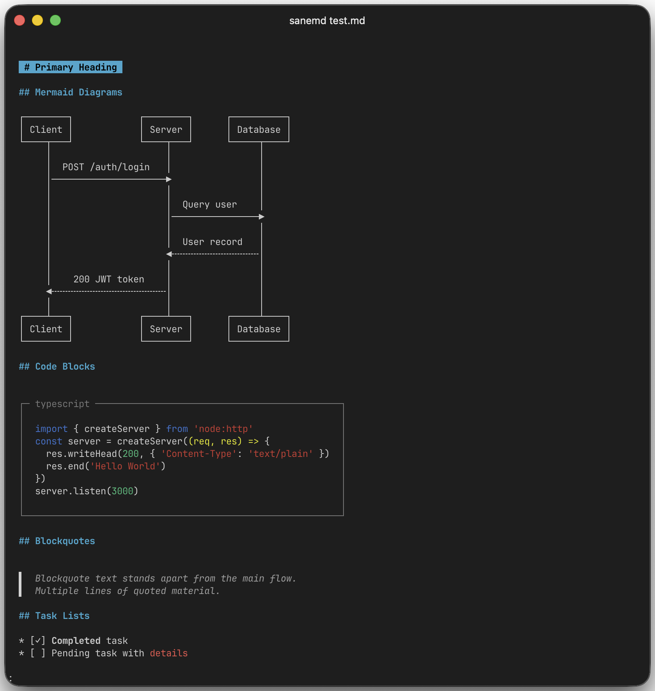
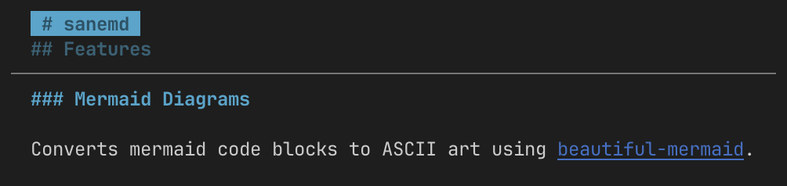

# sanemd

Terminal markdown renderer with mermaid diagram support.

- Mermaid diagrams → ASCII art
- Inline images (iTerm2, Kitty, Sixel, ANSI fallback)
- Syntax-highlighted code blocks with box borders
- Less-style pager with search and sticky headers



## Usage

```bash
# From file
sanemd README.md

# From stdin
cat README.md | sanemd
echo "# Hello **world**" | sanemd

# Bypass pager
sanemd --no-pager README.md
```

## Features

### Mermaid Diagrams

Converts mermaid code blocks to ASCII art using [beautiful-mermaid](https://github.com/nicober/beautiful-mermaid).

### Inline Images

Renders images directly in the terminal using [terminal-image](https://github.com/sindresorhus/terminal-image). Uses native terminal protocols (iTerm2, Kitty, Sixel) when available, falls back to ANSI block characters.

### Sticky Headers

When scrolled past a heading, ancestor headers appear dimmed at the top of the viewport, showing your position in the document hierarchy. For example, when reading content under an H3, the parent H2 and H1 are displayed above with a separator line.



### Syntax Highlighting

Code blocks with language tags are wrapped in box-drawing borders with language label. Uses VS Code Dark+ terminal colors.

````markdown
```typescript
const x = 1
```
````

Renders as:

```
┌─ typescript ──┐
│               │
│  const x = 1  │
│               │
└───────────────┘
```

### Task Lists

Checkboxes render with `[✓]` for completed items:

```markdown
- [x] Done
- [ ] Pending
```

### Blockquotes

Blockquotes display with a left half block pipe and dimmed italic text:

```markdown
> This is a quote
```

Renders as:

```
▌  This is a quote
```

### Inline Formatting

- **Bold** renders with ANSI bold
- *Italic* renders with ANSI italic
- ~~Strikethrough~~ renders with muted color
- `code` renders with red on dark background
- [Links](url) render in blue

### Headings

H1 headings render as pill-style labels (black text on blue background, padded, no `#` prefix). Other headings render in cyan bold.

### Indentation

Paragraphs and headings are indented for better readability.

## Pager Mode

For long documents, sanemd automatically activates a `less`-like pager when:
- Output is to a TTY (not piped)
- Content exceeds terminal height

### Keyboard Shortcuts

| Key           | Action               |
| ------------- | -------------------- |
| `j` / `↓`     | Scroll down one line |
| `k` / `↑`     | Scroll up one line   |
| `Space` / `f` | Page down            |
| `b`           | Page up              |
| `d`           | Half page down       |
| `u`           | Half page up         |
| `g`           | Go to top            |
| `G`           | Go to bottom         |
| `/`           | Search forward       |
| `?`           | Search backward      |
| `n`           | Next header          |
| `N`           | Previous header      |
| `=`           | Show position info   |
| `q`           | Quit                 |
