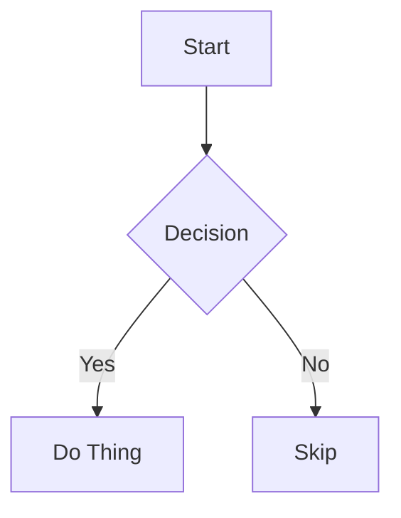

# Exhaustive Markdown Test

A document exercising every element `sanemd` renders. Useful for spot-checking spacing, breadcrumbs, and inline styles.

## Headings

Headings render with a `#`-prefix proportional to level (H1 is a filled bar).

### Level Three

Sub-section text.

#### Level Four

Deeper section text.

## Inline Styles

This paragraph mixes **bold**, _italic_, **_bold italic_**, ~~strikethrough~~, `inline code`, and a [link to example.com](https://example.com). Press <kbd>Ctrl</kbd>+<kbd>C</kbd> to copy.

A line break appears here:
this text follows a hard break.

## Paragraphs

First paragraph. The quick brown fox jumps over the lazy dog. Pack my box with five dozen liquor jugs.

Second paragraph, separated by a blank line. Sphinx of black quartz, judge my vow.

## Lists

### Unordered

- Apples
- Oranges
- Bananas
  - Cavendish
  - Plantain

### Ordered

1. First
2. Second
3. Third
   1. Nested first
   2. Nested second

### Task list

- [x] Completed item
- [ ] Pending item
- [ ] Another pending item

## Blockquote

> A single-line blockquote.

> A multi-paragraph blockquote.
>
> Second paragraph inside the quote, with **bold** and `code`.

## Code

Inline `code` plus fenced blocks below.

```ts
export function greet(name: string): string {
  return `Hello, ${name}!`
}
```

```bash
echo "no language? still rendered"
ls -la
```

```
plain block with no language
multiple lines
```

## Table

| Column A | Column B | Column C |
| -------- | -------- | -------- |
| alpha    | one      | x        |
| bravo    | two      | y        |
| charlie  | three    | z        |

## Horizontal Rule

Above the rule.

---

Below the rule.

## Image


A paragraph with an inline  reference.

## HTML Passthrough

<div>Raw HTML block content.</div>

## Mermaid



## Mixed Content

A paragraph followed immediately by a list:

- item one
- item two

And a list followed by a code block:

```js
console.log('done')
```

### Deep Nesting

> Quote containing a list:
>
> - quoted item one
> - quoted item two
>
> And quoted code:
>
> ```
> quoted code
> ```

#### Final Heading

End of document.
