# DOT Digraph Rendering Test

Exercise of the DOT subset `viewmd` renders. `replaceDotBlocks` translates each
`dot` / `graphviz` fence into a mermaid `flowchart` (`dotToMermaid`), then hands
it to `beautiful-mermaid` for the ASCII pass — the same renderer behind
`test/mermaid.md`.

DOT constructs with no flowchart equivalent (records, ports, HTML labels) are
rejected rather than approximated; those blocks degrade to their raw source —
see the last section.

## Fence Languages

### `dot`

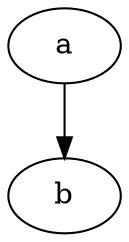

### `graphviz`


## Direction (`rankdir`)

### Default (top-down)

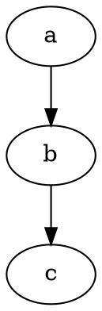

### Left-right

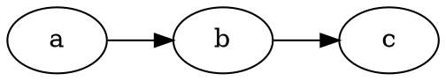

### Bottom-top

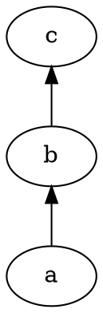

### Right-left

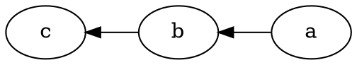

### Set via a `graph` attribute statement

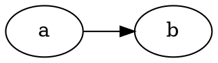

## Nodes

### Bare ids become their own label

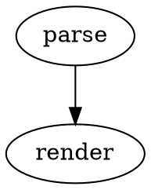

### Explicit labels

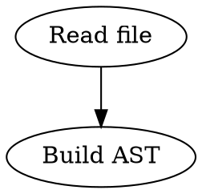

### Quoted ids with spaces and punctuation

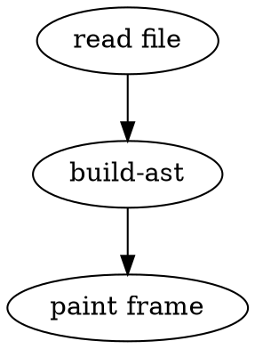

### Shapes

`beautiful-mermaid` paints every flowchart node as a rectangle, so shape is
carried through the translation but does not change the ASCII output.

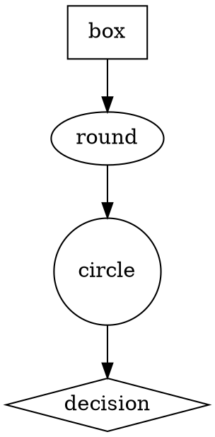

### Default shape via a `node` statement

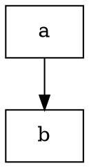

## Edges

### Chains expand to one edge per hop

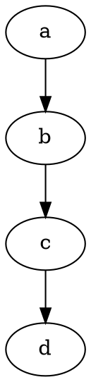

### Edge labels

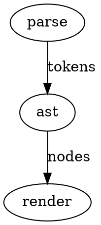

### Fan-out and fan-in

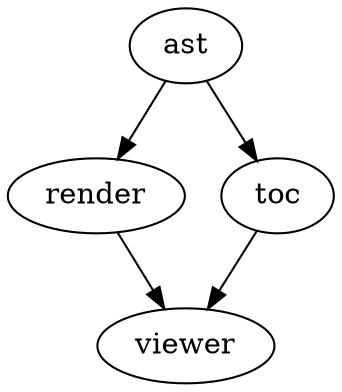

### Undirected graphs

`graph` with `--` edges translates to arrows; the flowchart renderer has no
undirected edge.

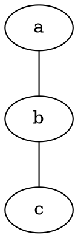

### `strict` prefix


## Subgraphs

### `cluster*` subgraphs draw a box

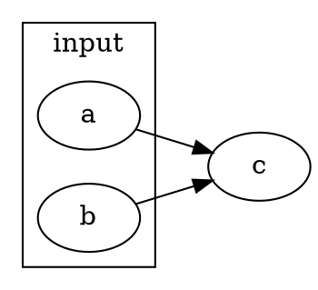

### Plain subgraphs only scope, matching Graphviz


## Comments


## A Realistic Pipeline

```dot
digraph viewmd {
  rankdir=TB;
  node [shape=box];

  file [label="markdown"];
  file -> preprocess [label="raw"];
  preprocess -> ast [label="fences swapped"];
  ast -> toc;
  ast -> viewer;
  toc -> viewer [label="jump"];
}
```

## Graceful Degradation (unsupported constructs)

`dotToMermaid` throws `UnsupportedDotError` for these, and `replaceDotBlocks`
leaves the fence untouched so it renders as a framed code block.

### Record shapes

```dot
digraph g {
  x [shape=record, label="<f0>left|<f1>right"];
  x -> y;
}
```

### Record ports

```dot
digraph g {
  a:f0 -> b:f1;
}
```

### HTML labels

```dot
digraph g {
  a [label=<<b>bold</b>>];
  a -> b;
}
```

### Empty graph

```dot
digraph g {
}
```

### Malformed source

```dot
digraph g {
  a -> b;
```
