# Mermaid Rendering Test

Exhaustive exercise of every mermaid diagram type and syntax feature that
`beautiful-mermaid` (the renderer behind `viewmd`) supports. Each block is
pre-rendered to ASCII by `replaceMermaidBlocks` before the AST is built.

ASCII-rendered types: flowchart, state, sequence, class, ER.
Unsupported types (including xychart, which the lib only renders as SVG, not
ASCII) degrade gracefully to their raw source — see the last section.

## Flowcharts

### Direction: Top-Down (`graph TD`)

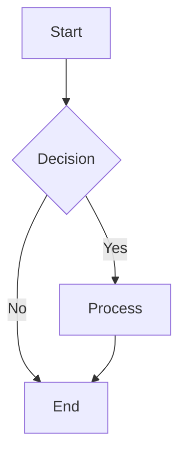

### Direction: Left-Right (`graph LR`)

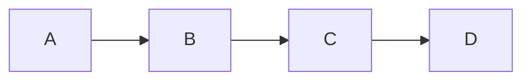

### Direction: Bottom-Top (`graph BT`)

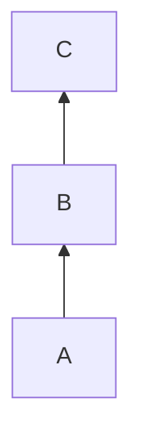

### Direction: Right-Left (`graph RL`)

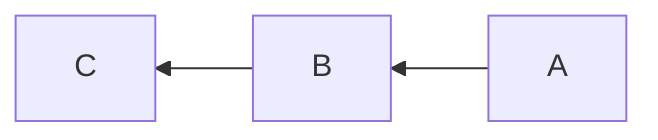

### `flowchart` keyword alias


### Node shapes

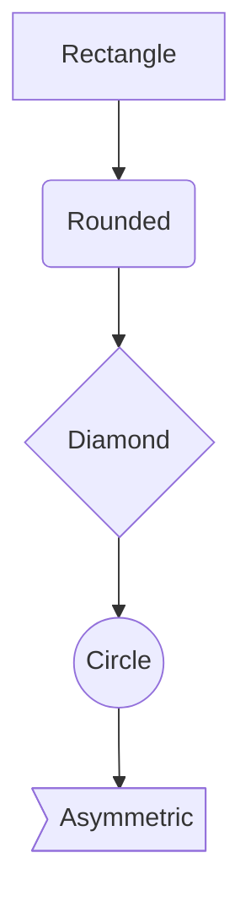

### Edge styles and labels

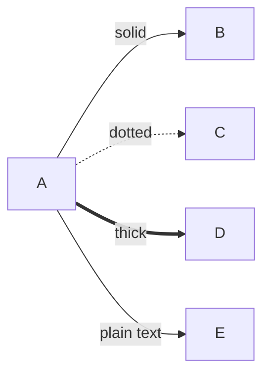

### Subgraphs

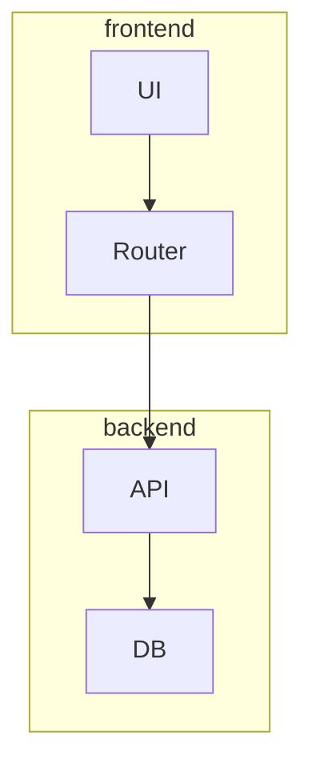

### Inline `linkStyle`

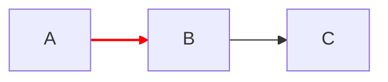

## State Diagrams

### Basic transitions

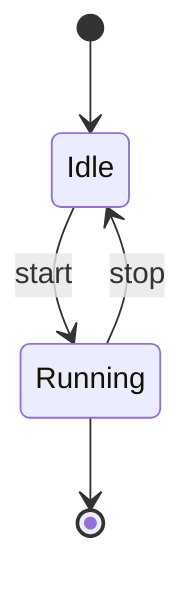

### Composite state

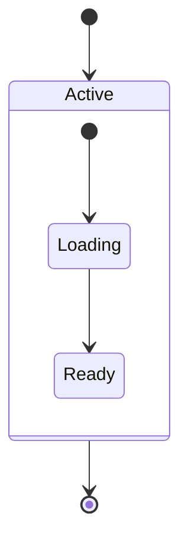

### Fork

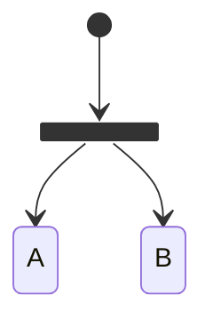

### Notes

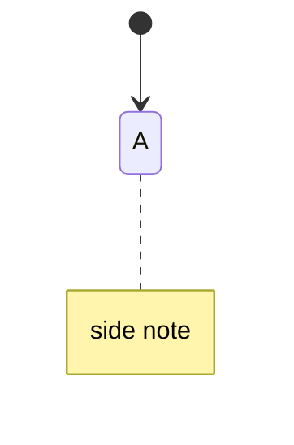

## Sequence Diagrams

### Basic messages (sync / async)

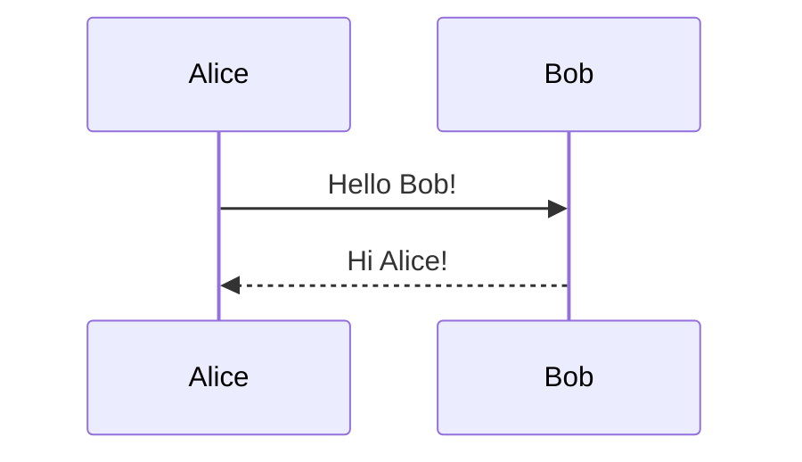

### Participants and activation

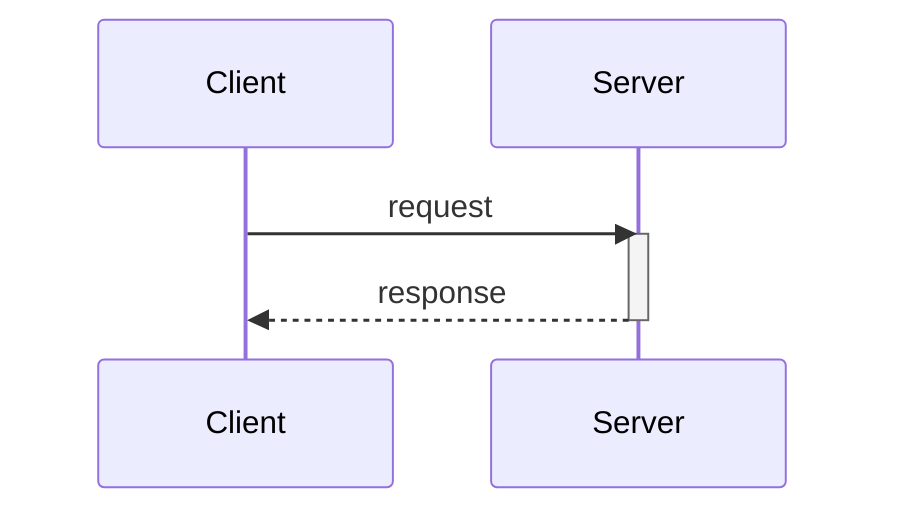

### Loops

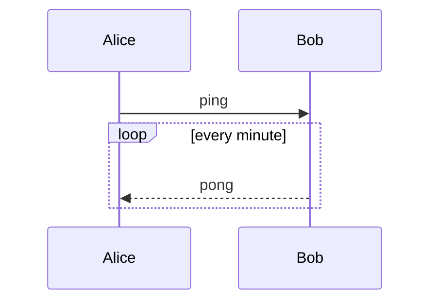

### Alt / else

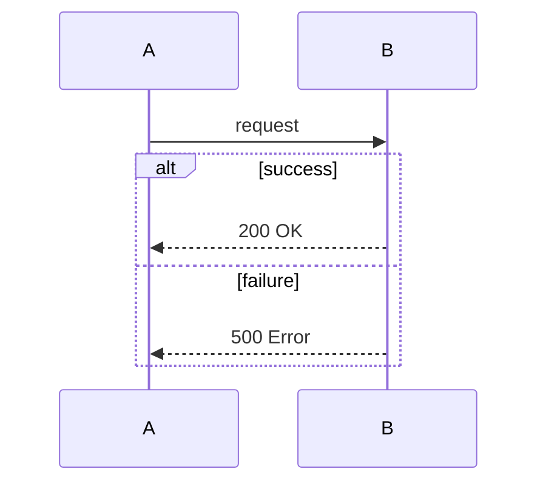

### Optional block

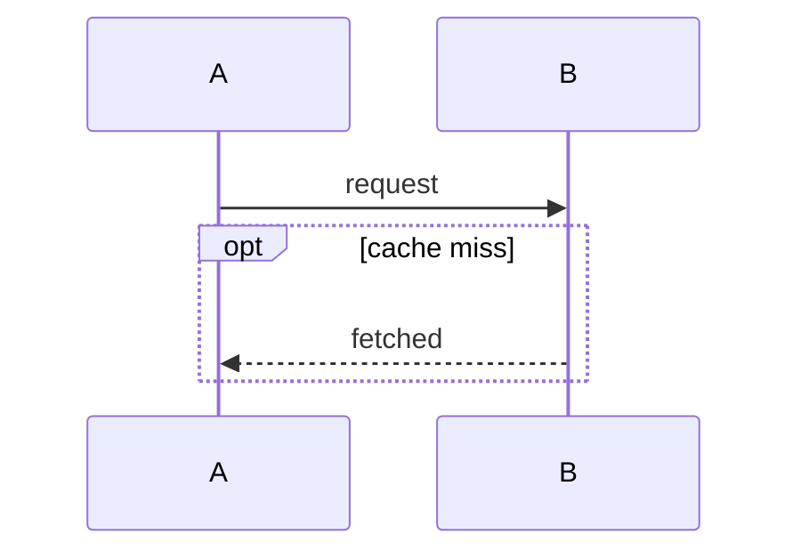

### Parallel block

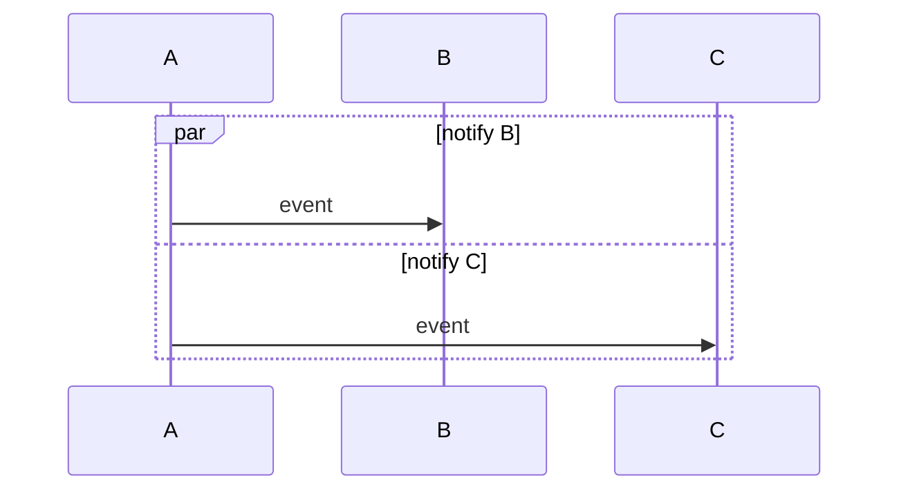

### Notes

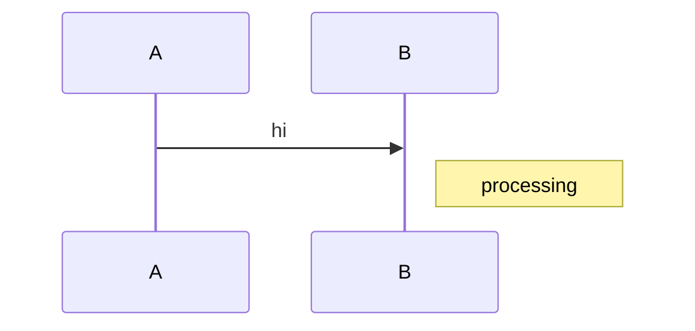

## Class Diagrams

### Attributes and methods

```mermaid
classDiagram
  class Animal {
    +String name
    +int age
    +move()
    +eat()
  }
```

### Relationship types

```mermaid
classDiagram
  Animal <|-- Dog
  Car *-- Engine
  House o-- Room
  Client ..> Service
  Order --> Customer
```

### Generics

```mermaid
classDiagram
  class List~T~ {
    +add(T item)
    +get(int i) T
  }
```

## ER Diagrams

### Cardinality variants

```mermaid
erDiagram
  A ||--|| B : one-to-one
  A ||--o{ C : one-to-zero-many
  A ||--|{ D : one-to-many
  A }o--o{ E : many-to-many
```

### Entity attributes

```mermaid
erDiagram
  CUSTOMER {
    string name
    int id
  }
  ORDER {
    int number
    date created
  }
  CUSTOMER ||--o{ ORDER : places
```

## Graceful Degradation (unsupported types)

These types have no ASCII renderer in `beautiful-mermaid` 0.1.3; the renderer
throws and `replaceMermaidBlocks` falls back to showing the raw source
unchanged. (xychart renders as SVG only, so it lands here too.)

### XY Chart (SVG-only)

```mermaid
xychart-beta
  title "Monthly Revenue"
  x-axis [Jan, Feb, Mar, Apr, May, Jun]
  y-axis "Revenue ($K)" 0 --> 500
  bar [180, 250, 310, 280, 350, 420]
```

### Gantt

```mermaid
gantt
  title Roadmap
  section Phase 1
  Design :a1, 2026-01-01, 30d
  Build  :a2, after a1, 45d
```

### Pie

```mermaid
pie title Pets
  "Dogs" : 40
  "Cats" : 60
```
