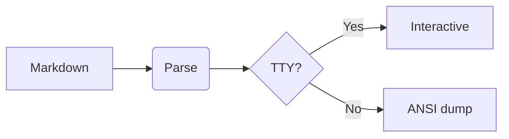
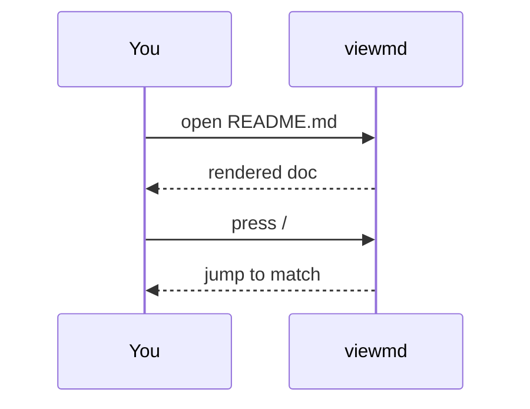

# viewmd

A markdown viewer that lives in your terminal. Scroll down for the tour.

Press <kbd>j</kbd>/<kbd>k</kbd> to scroll, <kbd>Tab</kbd> for the table of contents, and <kbd>/</kbd> to search.

## Diagrams

Mermaid fences render to ASCII art before the page is even built.



Flowcharts, sequence, state, class, and ER diagrams are all supported.



## Code blocks

Fenced code is syntax-highlighted with tree-sitter and framed in a labeled box.

```ts
export function greet(name: string): string {
  const greeting = `Hello, ${name}!`
  return greeting.toUpperCase()
}
```

```python
def fib(n: int) -> int:
    a, b = 0, 1
    for _ in range(n):
        a, b = b, a + b
    return a
```

## Rich text

### Inline styles

Mix **bold**, _italic_, `inline code`, ~~strikethrough~~, and [links](https://github.com).

### Tables

| Feature        | Shortcut     | Notes                    |
| -------------- | ------------ | ------------------------ |
| Scroll         | `j` / `k`    | line at a time           |
| Half page      | `d` / `u`    | like `less`              |
| Search         | `/` then `n` | forward and backward     |
| Open in editor | `e`          | jumps to cursor position |

### Lists

- [x] Sticky headers keep your place
- [x] Collapsible table-of-contents sidebar
- [ ] Read your mind (coming soon)

### Blockquotes

> The best interface is the one you already have open.
>
> — someone in a terminal

## Links & navigation

Not every link opens a browser. Relative `.md` links and in-document anchors
are followable in place: left-click one to jump, press <kbd>Backspace</kbd> to
go back.

Jump around this document by heading: [Diagrams](#diagrams),
[Code blocks](#code-blocks), [Sticky headers](#sticky-headers), or back up to
[the top](#viewmd).

Follow a relative link to another file and it opens right here:
[the exhaustive test doc](./exhaustive.md), the
[mermaid gallery](./mermaid.md), or the project [README](../README.md). A doc
link can target a heading too — [README, at Usage](../README.md#usage).

External links still behave normally and open in your browser:
[github.com](https://github.com).

## Sticky headers

As you scroll past this heading, its ancestors stay pinned at the top so you
always know where you are in the document.

### A nested section

Keep scrolling and watch the breadcrumb at the top update to
`Sticky headers › A nested section`.

#### An even deeper section

The breadcrumb grows one crumb deeper. Headings currently on screen are hidden
from the breadcrumb so it never repeats what you can already see.

## That's the tour

Point `viewmd` at any markdown file:

```sh
viewmd README.md
```

Press <kbd>q</kbd> to quit.
